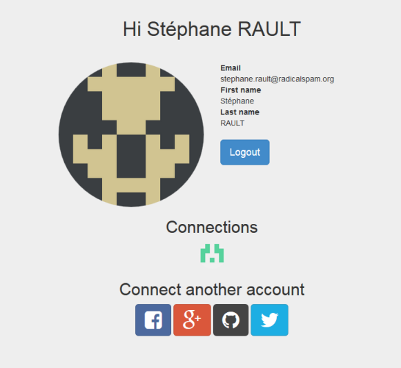

flask-social-blueprint
======================

An OAuth based authentication blueprint for flask. Easy to extend and
override.

https://github.com/wooyek/flask-social-blueprint

**See example/mongodb/README.rst for MongoDB Release**

.. image:: login-form.png
   :alt: Login Form
   :align: center

Demo
----

Based on ``example/gae`` codebase with secret ``settings_prd.py``
provided for proper OAuth providers configuration

http://flask-social-blueprint.appspot.com/

Why?
----

There is `Flask-Social`_ extension, but is painfully interconnected and
to change anything you basically have to fork and rewrite portions of
it.

Not to mention that it requires POST request on social login endpoints.
I hate that I need to write an inline forms to create a login button.

How it’s any better?
--------------------

This blueprint plays nicely with `Flask-Security`_ and it’s easily
overridable without forking everything, it’s plain simple OOP no that
single module based provider search crap.

To extend it just write a provider class anywhere you want, and setup
it’s client id and secret in the flask settings providing an import path
like this:

.. code:: python

    SOCIAL_BLUEPRINT = {
        # https://developers.facebook.com/apps/
        "flask_social_blueprint.providers.Facebook": {
            # App ID
            'consumer_key': '197…',
            # App Secret
            'consumer_secret': 'c956c1…'
        },
        # https://apps.twitter.com/app/new
        "flask_social_blueprint.providers.Twitter": {
            # Your access token from API Keys tab
            'consumer_key': 'bkp…',
            # access token secret
            'consumer_secret': 'pHUx…'
        },
        # https://console.developers.google.com/project
        "flask_social_blueprint.providers.Google": {
            # Client ID
            'consumer_key': '797….apps.googleusercontent.com',
            # Client secret
            'consumer_secret': 'bDG…'
        },
        # https://github.com/settings/applications/new
        "flask_social_blueprint.providers.Github": {
            # Client ID
            'consumer_key': '6f6…',
            # Client Secret
            'consumer_secret': '1a9…'
        },
    }

Done!

What’s missing?
---------------

This is just authentication blueprint there is no templates, models and
stuff that you would want to customize yourself.

Examples
--------

The example has a working model and templates, has a bunch of
dependencies like Flask-SLQAlchemy, you can take it as a wire frame
modify and build your app with that.

Examples are made from some existing apps, they may contain more stuff
that’s really needed to showcase this module. When in trouble just ask
questions.

Or just drop in this solution inside your working Flask app. I should
not create any conflicts with existing stuff. You maybe required to
write an adapter for your User model and SocialConnection model (or
similar) but that’s 3 functions for the adapter. Any User model
requirements come from Flask\_security.

What to do more?
----------------

1. More providers
2. Make Flask-Security dependency optional

.. _Flask-Social: https://pythonhosted.org/Flask-Social/
.. _Flask-Security: https://pythonhosted.org/Flask-Security/
