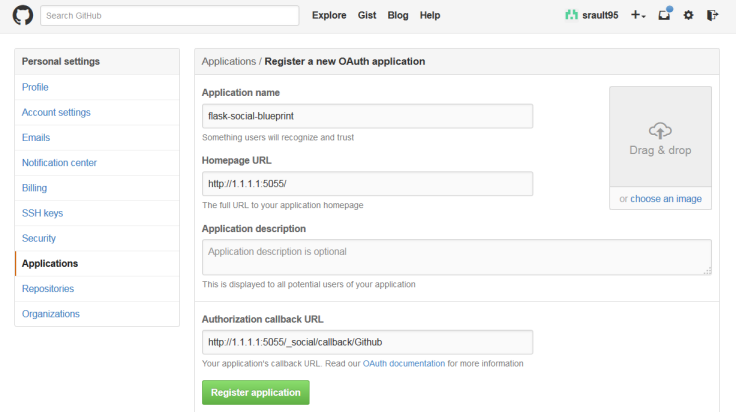
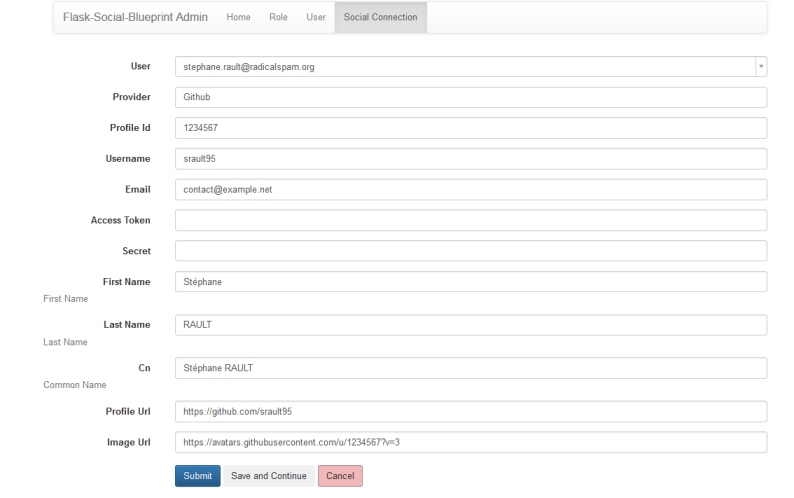

======================================
Flask Social Blueprint MongoDB Example
======================================

.. contents:: **Table of Contents**

Screenshots
-----------

.. image:: login-form.png
   :alt: Login Form
   :align: center
   

.. image:: user-profile.png
   :alt: User Profile
   :align: center

      
Required
--------

- Linux (tested on Ubuntu 14.04 - Trusty)
- MongoDB Server 2.4+
- Python 2.7+
- see requirements.txt file for python packages

For run example - Resume
------------------------

- Obtain client ids and secrets from OAuth providers using URL::

    - http://dev.example.com:5055/_social/callback/Google
    - http://dev.example.com:5055/_social/callback/Facebook
    - http://dev.example.com:5055/_social/callback/Twitter
    - http://dev.example.com:5055/_social/callback/Github

- Put them in the `settings.py` in the `SOCIAL_BLUEPRINT` settings or with environment

- Install package dependencies or launch with docker

- Run web server `python main.py`

- Open <http://dev.example.com:5055> your browser

Twitter
:::::::

Create new application here: https://apps.twitter.com/app/new

Google
::::::

1. Create new project here: https://console.developers.google.com/project
2. In APIs & auth > Credentials create Client ID
3. Update consent screen details, at least product name, home page and email address
4. Enable Google+ API

Github
::::::

Create new application here: https://github.com/settings/applications/new

Facebook
::::::::

Create new application here: https://developers.facebook.com/apps/

Setup `Valid OAuth redirect URIs` in Settings > Advanced > Security

Manuel installation
-------------------

.. note::

    Require MongoDB server started
    
    Please modify setting or environment for ip:port on MongoDB server

::

    $ git clone https://github.com/srault95/flask-social-blueprint.git -b mongodb    

    $ virtualenv myenv && source myenv/bin/activate
    
    $ cd flask-social-blueprint/example/mongodb

    $ pip install -r requirements.txt 

    # edit and update settings_local.py file
    $ vi settings_local.py
    
    $ python main.py
    

Run with Dockerfile
-------------------

::

    $ curl -O -k https://raw.githubusercontent.com/srault95/flask-social-blueprint/mongodb/example/mongodb/Dockerfile

    $ docker build -t mysocialflask .
    
    # Test your build
    $ docker run -it --rm mysocialflask python -V

    # Start Mongodb Server    
    $ docker start mongodb

Run Server with settings_local.py file
::::::::::::::::::::::::::::::::::::::

::

    $ curl -O -k https://raw.githubusercontent.com/srault95/flask-social-blueprint/mongodb/example/mongodb/settings_local.py

    # edit and update settings_local.py file
    $ vi settings_local.py
    
    $ docker run -d --name socialflask -p 5055:5055 \
      -v `pwd`/settings_local.py:/data/flask-social-blueprint/example/mongodb/settings_local.py \
      --link mongodb:mongodb mysocialflask

    # Open browser in : http://YOUR_ADDRESS:5055/admin and auth with social buttons
    
Run Server with environment
:::::::::::::::::::::::::::

::

    All keys is not required. Just one or several ! 
    
    $ docker run -d --name socialflask -p 5055:5055 \
      -e FACEBOOK_KEY=xxx -e FACEBOOK_SECRET=xxx \
      -e TWITTER_KEY=xxx -e TWITTER_KEY=xxx \
      -e GOOGLE_KEY=xxx -e GOOGLE_SECRET=xxx \
      -e GITHUB_KEY=xxx -e GITHUB_SECRET=xxx \
      --link mongodb:mongodb mysocialflask

    # Open browser in : http://YOUR_ADDRESS:5055/admin and auth with social buttons
    

Administration Interface (light)
--------------------------------

http://YOUR_FLASK_SOCIAL_IP:5055/admin

Environment variables
---------------------

::

    MONGODB_DATABASE=flask_social_blueprint
    
    MONGODB_PORT_27017_TCP_ADDR=127.0.0.1
    
    MONGODB_PORT_27017_TCP_PORT=27017
    
    # No set default
    MONGODB_USERNAME=None

    # No set default
    MONGODB_PASSWORD=None
    
